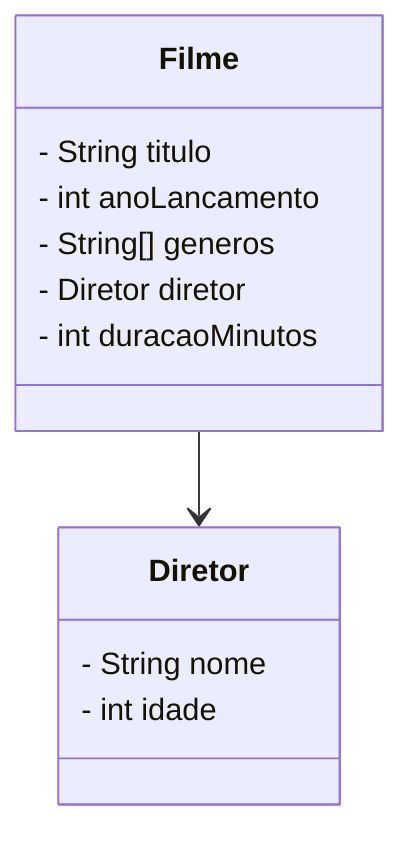

```mermaid
classDiagram
    class Filme {
        - String titulo
        - int anoLancamento
        - String[] generos
        - Diretor diretor
        - int duracaoMinutos
    }

    class Diretor {
        - String nome
        - int idade
    }

    Filme --> Diretor
```
